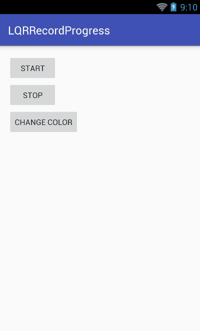

# LQRRecordProgress
仿微信小视频进度条

## 一、使用：
	
1、布局中使用：

	<com.lqr.recordprogress.LQRRecordProgress
	        android:id="@+id/rp"
	        android:layout_width="match_parent"
	        android:layout_height="5dp"
	        app:rp_progress_color="#0f0"
	        app:rp_record_time="2"/>

2、代码控制：

	mRp = (LQRRecordProgress) findViewById(R.id.rp);
	mRp.start();//开始进度动画
	mRp.stop();//开关进度动画
	mRp.setProgressColor(Color.parseColor("#FF1493"));//设置进度条颜色
	mRp.setRecordTime(20);//设置进度条的显示时间

## 二、效果：

